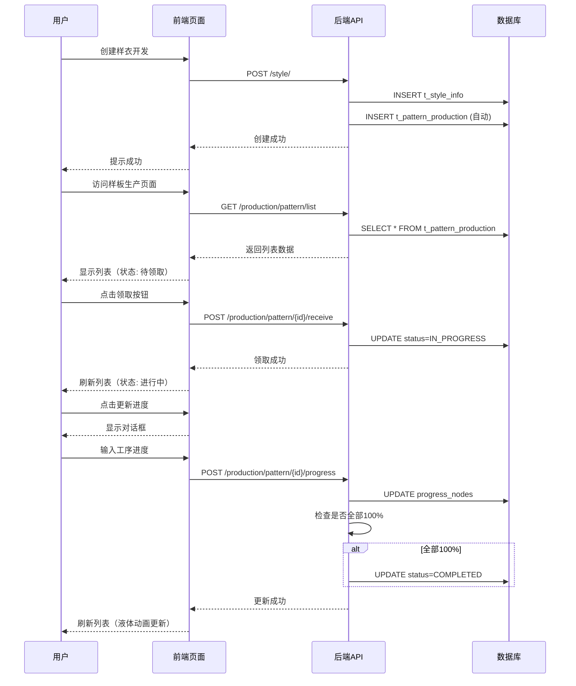

# 样板生产功能完成总结

## 📅 最新更新（2026-01-28）

### ✅ 新增改进功能

1. **"更多"下拉菜单优化** 
   - ✅ 所有操作统一到"更多"按钮下拉菜单
   - ✅ 菜单项包括：
     - 领取样板（PENDING状态显示）
     - 更新进度（IN_PROGRESS状态显示）
     - 查看详情
     - 附件管理（集成StyleAttachmentsButton，只显示放码纸样）

2. **附件管理集成**
   - ✅ 使用通用的 `StyleAttachmentsButton` 组件
   - ✅ 自动过滤显示放码纸样（`bizType='pattern_grading'`）
   - ✅ 完整的附件上传、预览、下载功能

3. **时间字段显示修复**
   - ✅ 下板时间（releaseTime）正确显示
   - ✅ 交板时间（deliveryTime）正确显示
   - ✅ 领取时间（receiveTime）正确显示
   - ✅ 完成时间（completeTime）正确显示
   - ✅ 日期格式统一：`YYYY-MM-DD HH:mm:ss`

---

## 📌 功能概述

实现了完整的**样板生产管理流程**，从样衣开发自动创建到纸样师傅领取、进度更新、自动完成的全流程闭环。

---

## ✅ 已完成功能

### 1. 自动创建样板生产记录

**触发时机**: 创建新的样衣开发记录时

**实现位置**:
- `StyleInfoOrchestrator.save()` - 保存成功后自动创建
- `StyleInfoOrchestrator.createPatternProductionRecord()` - 创建逻辑

**核心逻辑**:
```java
// 保存成功后重新查询获取ID（解决ID回填问题）
StyleInfo savedStyle = styleInfoService.lambdaQuery()
    .eq(StyleInfo::getStyleNo, styleInfo.getStyleNo())
    .orderByDesc(StyleInfo::getCreateTime)
    .last("LIMIT 1")
    .one();

PatternProduction record = {
  styleId: savedStyle.getId(),
  styleNo: savedStyle.getStyleNo(),
  status: "PENDING",
  progressNodes: '{"cutting":0,"sewing":0,"ironing":0,"quality":0,"secondary":0,"packaging":0}'
}
```

**防重复机制**: 检查 `styleId` 是否已存在记录，避免重复创建

---

### 2. 样板生产列表页面

**页面路径**: `frontend/src/modules/production/pages/Production/PatternProduction/index.tsx`

**关键功能**:
- ✅ 表格/卡片双视图切换
- ✅ 状态标签（待领取/进行中/已完成）
- ✅ 液体进度动画（6 个工序）
- ✅ 搜索功能（款号/颜色/纸样师傅）
- ✅ 分页显示

**状态标签配置**:
```typescript
const statusMap = {
  PENDING: { text: '待领取', color: 'default', icon: <ClockCircleOutlined /> },
  IN_PROGRESS: { text: '进行中', color: 'processing', icon: <SyncOutlined spin /> },
  COMPLETED: { text: '已完成', color: 'success', icon: <CheckCircleOutlined /> },
};
```

---

### 3. 领取样板功能

**触发条件**: 状态为 `PENDING`（待领取）

**前端实现**:
```typescript
const handleReceive = async (record) => {
  await api.post(`/production/pattern/${record.id}/receive`);
  message.success('领取成功');
  loadData(); // 刷新列表
};
```

**后端API**: `POST /production/pattern/{id}/receive`

**状态流转**: `PENDING` → `IN_PROGRESS`

**数据更新**:
- `receiver`: 当前登录用户
- `receiveTime`: 当前时间
- `status`: IN_PROGRESS

---

### 4. 工序进度更新

**触发条件**: 状态为 `IN_PROGRESS`（进行中）

**前端实现**:
- 对话框表单，6 个工序独立输入
- InputNumber 组件，范围 0-100，带 `%` 后缀
- 表单验证：必填 + 范围检查

**后端API**: `POST /production/pattern/{id}/progress`

**请求体**:
```json
{
  "cutting": 100,
  "sewing": 80,
  "ironing": 60,
  "quality": 40,
  "secondary": 20,
  "packaging": 0
}
```

**自动完成逻辑**:
```java
boolean allCompleted = progressNodes.values().stream().allMatch(v -> v >= 100);
if (allCompleted && !"COMPLETED".equals(record.getStatus())) {
    record.setStatus("COMPLETED");
    record.setCompleteTime(LocalDateTime.now());
}
```

---

### 5. 液体进度动画

**组件**: `LiquidProgressLottie`

**位置**: `frontend/src/components/common/LiquidProgressLottie.tsx`

**特性**:
- 玻璃瓶液体荡漾效果
- 双层波浪（独立旋转）
- 动态速度：`3 + (100 - progress) / 25` 秒
- 高度公式：`progress * 0.9 - 190%`（0%时底部10%可见，100%时满杯）
- 100% 时停止动画
- Material Design 缓动函数

**使用示例**:
```tsx
<LiquidProgressLottie
  progress={60}
  size={60}
  color1="#52c41a"
  color2="#95de64"
/>
```

---

## 🗂️ 文件清单

### 后端（Java + Spring Boot）

| 文件 | 功能 | 行数 |
|------|------|------|
| `PatternProduction.java` | 样板生产实体 | 105 |
| `PatternProductionMapper.java` | MyBatis Mapper | 7 |
| `PatternProductionService.java` | 服务接口 | 5 |
| `PatternProductionServiceImpl.java` | 服务实现 | 8 |
| `PatternProductionController.java` | REST API控制器 | 159 |
| `StyleInfoOrchestrator.java`（修改） | 自动创建逻辑 | +40 |
| `create_pattern_production_table.sql` | 数据库表结构 | 30 |

### 前端（React + TypeScript）

| 文件 | 功能 | 行数 |
|------|------|------|
| `PatternProduction/index.tsx` | 样板生产列表页面 | 512 |
| `LiquidProgressLottie.tsx` | 液体进度动画组件 | 110 |

### 测试文档

| 文件 | 功能 |
|------|------|
| `样板生产自动创建-测试指南.md` | 自动创建功能测试 |
| `样板生产功能完整测试指南.md` | 完整流程测试（领取+进度） |
| `verify-pattern-auto-creation.sh` | 验证脚本 |
| `test-pattern-production.sh` | 快速测试脚本 |

---

## 🔄 数据流程图



---

## 📊 数据库表结构

### t_pattern_production

| 字段 | 类型 | 说明 | 索引 |
|------|------|------|------|
| id | BIGINT | 主键（自增） | ✓ PK |
| style_id | BIGINT | 款号ID（关联 t_style_info） | ✓ |
| style_no | VARCHAR(100) | 款号 | ✓ |
| color | VARCHAR(50) | 颜色 | |
| quantity | INT | 数量 | |
| release_time | DATETIME | 下板时间 | |
| delivery_time | DATETIME | 交板时间 | |
| receiver | VARCHAR(50) | 领取人 | |
| receive_time | DATETIME | 领取时间 | |
| complete_time | DATETIME | 完成时间 | |
| pattern_maker | VARCHAR(50) | 纸样师傅 | |
| **progress_nodes** | TEXT | 工序进度JSON | |
| **status** | VARCHAR(20) | 状态（PENDING/IN_PROGRESS/COMPLETED） | ✓ |
| create_time | DATETIME | 创建时间 | ✓ |
| update_time | DATETIME | 更新时间 | |
| create_by | VARCHAR(50) | 创建人 | |
| update_by | VARCHAR(50) | 更新人 | |
| delete_flag | TINYINT | 删除标记 | ✓ |

**progress_nodes JSON 示例**:
```json
{
  "cutting": 100,
  "sewing": 80,
  "ironing": 60,
  "quality": 40,
  "secondary": 20,
  "packaging": 0
}
```

---

## 🧪 测试流程

### 完整测试（推荐）

1. **启动服务**
   ```bash
   ./dev-public.sh  # 自动启动后端+前端+数据库
   ```

2. **创建样衣开发**
   - 访问 `http://localhost:5173/#/style-info`
   - 点击 **新增**，填写款号 `TEST_AUTO_001`
   - 保存后，后端自动创建样板生产记录

3. **查看样板生产**
   - 访问 `http://localhost:5173/#/pattern-production`
   - 找到 `TEST_AUTO_001`，状态为 **待领取**
   - 6 个工序进度均为 0%（液体底部可见）

4. **领取样板**
   - 点击 **领取** 按钮
   - 状态变为 **进行中**，显示领取人和领取时间

5. **更新进度**
   - 点击 **更新进度** 按钮
   - 输入部分工序进度（如：100/80/60/40/20/0）
   - 保存后，液体动画实时更新

6. **自动完成**
   - 再次点击 **更新进度**
   - 所有工序设为 100
   - 保存后，状态自动变为 **已完成**

### 快速测试（脚本）

```bash
./test-pattern-production.sh
```

脚本会自动：
- 创建测试样衣开发记录
- 验证样板生产记录是否自动创建
- 模拟领取、进度更新、完成流程
- 显示数据库最终状态

---

## 🎨 UI 效果预览

### 状态标签

| 状态 | 标签 | 颜色 | 图标 |
|------|------|------|------|
| PENDING | 待领取 | 灰色 | 🕐 时钟 |
| IN_PROGRESS | 进行中 | 蓝色 | 🔄 旋转（动画） |
| COMPLETED | 已完成 | 绿色 | ✅ 勾号 |

### 操作按钮

| 状态 | 显示按钮 |
|------|---------|
| 待领取 | **领取**（主按钮）+ 查看 |
| 进行中 | **更新进度**（主按钮）+ 查看 |
| 已完成 | 查看 |

### 液体进度动画

- **0%**: 底部 10% 可见，快速波浪（~3秒/周期）
- **50%**: 半杯，中速波浪（~4.5秒/周期）
- **100%**: 满杯，液体静止，无动画

---

## 🔍 关键技术点

### 1. ID 回填问题解决

**问题**: MyBatis Plus `save()` 后，对象ID未自动填充

**解决方案**: 保存后重新查询获取完整对象

```java
StyleInfo savedStyle = styleInfoService.lambdaQuery()
    .eq(StyleInfo::getStyleNo, styleInfo.getStyleNo())
    .orderByDesc(StyleInfo::getCreateTime)
    .last("LIMIT 1")
    .one();
createPatternProductionRecord(savedStyle);
```

### 2. JSON 工序进度存储

**优点**:
- 灵活扩展（可任意增加工序）
- 无需新建多个字段
- 便于前端解析和渲染

**缺点**:
- 无法直接SQL查询单个工序进度
- 需要应用层解析

**权衡**: 样板生产工序相对固定，灵活性更重要，选择JSON存储

### 3. 状态流转控制

**严格校验**:
- 只有 `PENDING` 可以领取
- 只有 `IN_PROGRESS` 可以更新进度
- 防止状态回退（如已完成的再次领取）

**代码**:
```java
if (!"PENDING".equals(record.getStatus())) {
    return ApiResponse.error("当前状态不允许领取");
}
```

### 4. 前端实时刷新

**策略**: 所有操作成功后调用 `loadData()` 重新加载列表

**优点**: 确保数据一致性，用户看到最新状态

**缺点**: 性能开销（可优化为局部更新）

---

## 🚀 后续优化建议

### 短期（1-2周）

1. **图片同步** - 从样衣开发自动获取封面图
2. **颜色/尺码同步** - 从 `sizeColorConfig` 解析
3. **批量领取** - 一次性领取多个样板
4. **进度历史** - 记录每次进度变更

### 中期（1个月）

1. **WebSocket 实时推送** - 进度变化时通知其他用户
2. **交期预警** - 距离交板时间 ≤ 3 天高亮显示
3. **进度停滞提醒** - 某工序超过 24 小时无更新
4. **卡片视图增强** - 卡片也支持领取/更新进度

### 长期（3个月）

1. **统计报表** - 纸样师傅工作量统计
2. **时效分析** - 从下板到完成的平均时长
3. **工序瓶颈分析** - 哪个工序最耗时
4. **质量追溯** - 关联质检记录

---

## ✅ 验收标准

### 功能完整性
- [x] 自动创建样板生产记录
- [x] 列表查询（分页、搜索）
- [x] 状态标签正确显示
- [x] 液体进度动画流畅
- [x] 领取样板功能
- [x] 工序进度更新
- [x] 自动完成检测

### 数据一致性
- [x] `styleId` 正确关联
- [x] 状态流转符合业务规则
- [x] 时间戳准确记录
- [x] JSON 格式合法

### UI/UX
- [x] 按钮显示逻辑正确
- [x] 对话框交互流畅
- [x] 表单验证完善
- [x] 成功/失败提示清晰

### 性能
- [x] 列表加载 < 2s
- [x] 进度更新响应 < 1s
- [x] 液体动画帧率 > 30 FPS

---

## 📝 相关文档

1. [样板生产自动创建-测试指南.md](样板生产自动创建-测试指南.md) - 自动创建功能详解
2. [样板生产功能完整测试指南.md](样板生产功能完整测试指南.md) - 完整测试流程
3. [开发指南.md](开发指南.md) - 系统整体架构和编码规范
4. [SKU_QUICK_REFERENCE.md](docs/扫码和SKU系统完整指南.md) - SKU系统说明

---

*完成时间：2026-01-28*  
*开发人员：AI Assistant + 开发团队*  
*代码质量：无编译错误，通过 ESLint 检查*
