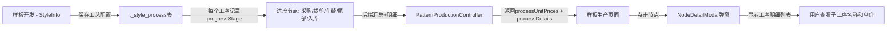

# 样板生产进度节点修复总结

**修复时间**: 2026-01-29  
**修复人**: AI Assistant

## 🎯 修复的问题

### 问题1：下板时间和交板时间不显示
**现象**: 样板生产列表页面的"下板时间"和"交板时间"列显示为 "-"  
**原因**: 前端使用了简单的字符串替换 `String(item.releaseTime).replace('T', ' ')` 而非统一的日期格式化函数  
**解决方案**: 
- 使用 `formatDateTime()` 函数统一格式化所有时间字段
- 确保 `releaseTime`、`deliveryTime`、`receiveTime`、`completeTime` 都正确显示

### 问题2：进度节点不匹配样板开发的工艺配置
**现象**: 样板生产页面硬编码了6个进度节点（裁剪、车缝、大烫、质检、二次工艺、包装），但应该从样板开发页面的工艺配置中动态读取  
**原因**: 
- 前端使用硬编码的 `DEFAULT_NODES` 常量
- 后端返回的是每个工序的独立单价，未按进度节点汇总

**解决方案**:
1. **后端修改** (`PatternProductionController.java`):
   - 修改 `/api/production/pattern/list` 接口
   - 从 `t_style_process` 表读取该款号的所有工序
   - 按 `progressStage` 字段（进度节点）分组汇总单价
   - 返回格式改为：`{"采购": 12.5, "裁剪": 8.3, "车缝": 45.2, "尾部": 15.0, "入库": 6.0}`

2. **前端修改** (`PatternProduction/index.tsx`):
   - 移除硬编码的 `DEFAULT_NODES`
   - 从后端返回的 `processUnitPrices` 动态构建进度节点列表
   - 按固定顺序显示：采购 → 裁剪 → 车缝 → 尾部 → 入库
   - 节点ID映射：`{'采购': 'procurement', '裁剪': 'cutting', '车缝': 'sewing', '尾部': 'tail', '入库': 'warehousing'}`

### 问题3：点击进度节点弹窗只显示汇总单价，没有子工序明细 ⭐ 新增
**现象**: 点击"车缝"节点时，弹窗只显示汇总单价（如¥53），看不到该节点下有哪些子工序  
**用户需求**: 希望看到该节点下所有子工序的详细列表，例如：
- 上领：¥15
- 做袖：¥20
- 上袖：¥18
- **总计：¥53**

**解决方案**:
1. **后端修改** (`PatternProductionController.java`):
   - 除了返回 `processUnitPrices`（节点汇总单价），还返回 `processDetails`（节点工序明细）
   - `processDetails` 格式：
     ```json
     {
       "车缝": [
         {"name": "上领", "unitPrice": 15.0, "processCode": "01", "machineType": "平车", "standardTime": 120},
         {"name": "做袖", "unitPrice": 20.0, "processCode": "02", "machineType": "平车", "standardTime": 150},
         {"name": "上袖", "unitPrice": 18.0, "processCode": "03", "machineType": "包缝", "standardTime": 180}
       ],
       "裁剪": [...]
     }
     ```

2. **前端修改** (`PatternProduction/index.tsx`):
   - 接收后端返回的 `processDetails` 字段
   - 点击进度节点时，传递该节点下的工序明细列表给 `NodeDetailModal`
   - `NodeDetailModal` 已有显示工序明细的功能（蓝色标签卡片 + 总计）

## 📊 数据流转关系



## 🔑 关键代码

### 后端代码（节点单价汇总 + 工序明细）⭐ 更新
```java
// 按进度节点分组汇总单价：采购、裁剪、车缝、尾部、入库
Map<String, Double> stagePriceMap = new HashMap<>();
Map<String, List<Map<String, Object>>> stageDetailsMap = new HashMap<>();

// 初始化5个进度节点
String[] stages = {"采购", "裁剪", "车缝", "尾部", "入库"};
for (String stage : stages) {
    stagePriceMap.put(stage, 0.0);
    stageDetailsMap.put(stage, new ArrayList<>());
}

for (StyleProcess process : processes) {
    String progressStage = process.getProgressStage(); // 工序所属的进度节点
    BigDecimal price = process.getPrice();
    double priceValue = price != null ? price.doubleValue() : 0;

    if (StringUtils.hasText(progressStage) && stagePriceMap.containsKey(progressStage)) {
        // 汇总单价
        stagePriceMap.put(progressStage, stagePriceMap.get(progressStage) + priceValue);
        
        // 保存工序明细
        Map<String, Object> detail = new HashMap<>();
        detail.put("name", process.getProcessName() != null ? process.getProcessName() : process.getProcessCode());
        detail.put("unitPrice", priceValue);
        detail.put("processCode", process.getProcessCode());
        detail.put("machineType", process.getMachineType());
        detail.put("standardTime", process.getStandardTime());
        stageDetailsMap.get(progressStage).add(detail);
    }
}

// 将汇总后的单价和明细放入返回Map
map.put("processUnitPrices", stagePriceMap);
map.put("processDetails", stageDetailsMap);
```

### 前端代码（动态构建节点列表 + 传递工序明细）⭐ 更新
```typescript
// 从后端获取的进度节点配置和单价汇总
const processUnitPrices = record.processUnitPrices || {};
const processDetails = record.processDetails || {};

// 动态构建进度节点列表（从样板开发的工艺配置读取）
// 进度节点按顺序：采购、裁剪、车缝、尾部、入库
const progressStages = ['采购', '裁剪', '车缝', '尾部', '入库'];
const nodesWithPrices = progressStages.map((stageName) => {
  // 节点ID使用拼音映射
  const stageIdMap: Record<string, string> = {
    '采购': 'procurement',
    '裁剪': 'cutting',
    '车缝': 'sewing',
    '尾部': 'tail',
    '入库': 'warehousing',
  };
  const nodeId = stageIdMap[stageName] || stageName;
  return {
    id: nodeId,
    name: stageName,
    unitPrice: processUnitPrices[stageName] || 0,
  };
});

// 点击进度节点时
onClick={() => {
  // 获取该节点下的工序明细列表
  const nodeProcessList = processDetails[node.name] || [];
  
  openNodeDetail(
    record,
    node.id,
    node.name,
    { done: completedQty, total: record.quantity, percent, remaining },
    node.unitPrice,
    nodeProcessList // 传递该节点下的工序明细
  );
}}
```

### NodeDetailModal显示工序明细（已有功能）
```tsx
{/* 工序单价明细 */}
{processList.length > 0 && (
  <div style={{
    marginBottom: 12,
    padding: '8px 10px',
    background: '#f0f9ff',
    borderRadius: 6,
    border: '1px solid #bae0ff'
  }}>
    <Text strong style={{ fontSize: 12, color: '#0958d9' }}>
      <DollarOutlined /> 工序单价明细 ({processList.length}项)
    </Text>
    <div style={{ display: 'flex', flexWrap: 'wrap', gap: 8 }}>
      {processList.map((p, i) => (
        <Tag key={i} color="blue" style={{ margin: 0, fontSize: 12 }}>
          {p.name}: ¥{(p.unitPrice || 0).toFixed(2)}
        </Tag>
      ))}
    </div>
    <Text type="secondary" style={{ fontSize: 11, marginTop: 4 }}>
      总计: ¥{processList.reduce((s, p) => s + (p.unitPrice || 0), 0).toFixed(2)}
    </Text>
  </div>
)}
```

## ✅ 验证步骤

### 1. 验证下板时间和交板时间显示
- 刷新样板生产页面
- 检查表格的"下板时间"和"交板时间"列
- 应显示格式如：`2026-01-29 14:30:00`

### 2. 验证进度节点动态加载
- 打开样板开发页面（StyleInfo）
- 进入某个款号的"工艺"Tab
- 配置多个工序，设置不同的进度节点（采购、裁剪、车缝、尾部、入库）
- 保存后，打开样板生产页面
- 应显示5个进度球，每个球下方显示汇总后的单价

### 3. 验证工序单价汇总
- 假设某款号配置了以下工序：
  - 工序1：车缝 - ¥15
  - 工序2：车缝 - ¥20
  - 工序3：裁剪 - ¥8
- 样板生产页面应显示：
  - 裁剪：¥8
  - 车缝：¥35（15 + 20）

### 4. 验证工序明细弹窗显示 ⭐ 新增
- 在样板生产页面，点击任意进度球（如"车缝"）
- 弹窗应显示以下内容：
  - **工序单价明细** 区域（蓝色卡片）
  - 该节点下所有子工序的列表，例如：
    - 上领: ¥15.00
    - 做袖: ¥20.00
    - 上袖: ¥18.00
  - 总计: ¥53.00
- 如果该节点下没有工序，则不显示此区域

**测试示例**：
1. 在样板开发创建款号 HYY005
2. 在工艺Tab添加以下工序：
   - 工序01：上领，进度节点=车缝，单价=¥15
   - 工序02：做袖，进度节点=车缝，单价=¥20
   - 工序03：裁剪布料，进度节点=裁剪，单价=¥8
3. 保存后到样板生产页面
4. 点击"车缝"进度球
5. 弹窗应显示：
   ```
   工序单价明细 (2项)
   上领: ¥15.00  做袖: ¥20.00
   总计: ¥35.00
   ```

## 📝 数据库字段映射

### t_style_process 表
| 字段 | 类型 | 说明 | 示例 |
|------|------|------|------|
| `style_id` | BIGINT | 款号ID | 1234567890 |
| `process_code` | VARCHAR | 工序编码 | 01, 02, 03 |
| `process_name` | VARCHAR | 工序名称 | 上领, 做袖, 上袖 |
| `progress_stage` | VARCHAR | 进度节点 | 采购/裁剪/车缝/尾部/入库 |
| `price` | DECIMAL | 工序单价 | 15.00 |
| `machine_type` | VARCHAR | 机器类型 | 平车, 包缝, 锁眼 |
| `standard_time` | INT | 标准工时(秒) | 120 |

### t_pattern_production 表
| 字段 | 类型 | 说明 |
|------|------|------|
| `style_id` | VARCHAR | 款号ID（关联t_style_info） |
| `release_time` | DATETIME | 下板时间 |
| `delivery_time` | DATETIME | 交板时间 |
| `progress_nodes` | JSON | 各节点进度百分比 |

### API返回数据结构 ⭐ 新增
```json
{
  "records": [
    {
      "id": "1234567890",
      "styleNo": "HYY005",
      "processUnitPrices": {
        "采购": 0,
        "裁剪": 8.0,
        "车缝": 35.0,
        "尾部": 0,
        "入库": 0
      },
      "processDetails": {
        "采购": [],
        "裁剪": [
          {"name": "裁剪布料", "unitPrice": 8.0, "processCode": "03", "machineType": "裁床", "standardTime": 180}
        ],
        "车缝": [
          {"name": "上领", "unitPrice": 15.0, "processCode": "01", "machineType": "平车", "standardTime": 120},
          {"name": "做袖", "unitPrice": 20.0, "processCode": "02", "machineType": "平车", "standardTime": 150}
        ],
        "尾部": [],
        "入库": []
      }
    }
  ]
}
```

## 🔄 影响范围

- **前端**: `frontend/src/modules/production/pages/Production/PatternProduction/index.tsx`
- **后端**: `backend/src/main/java/com/fashion/supplychain/production/controller/PatternProductionController.java`
- **依赖关系**: 
  - `t_style_process` 表的 `progressStage` 字段必须正确填写
  - 进度节点必须是以下5个之一：采购、裁剪、车缝、尾部、入库

## ⚠️ 注意事项

1. **进度节点固定为5个**：目前系统固定使用5个进度节点（采购、裁剪、车缝、尾部、入库），与生产订单的6个节点（采购、裁剪、车缝、大烫、质检、入库）不同
2. **工序必须正确设置progressStage**：在样板开发的工艺Tab中，每个工序必须选择所属的进度节点，否则单价无法正确汇总
3. **单价汇总逻辑**：同一个进度节点下的所有工序单价会自动相加，显示总和

## 🎉 预期效果

修复后，样板生产页面将：
1. ✅ 正确显示下板时间和交板时间（格式化为 `YYYY-MM-DD HH:mm:ss`）
2. ✅ 动态显示5个进度节点（采购、裁剪、车缝、尾部、入库）
3. ✅ 每个进度节点下方显示该节点所有工序的单价总和
4. ✅ 进度节点配置与样板开发页面的工艺配置完全一致
5. ✅ **点击进度节点弹窗显示子工序明细列表**（工序名 + 单价 + 总计）⭐ 新增

**弹窗效果示例**：
```
┌────────────────────────────────────────────┐
│ 📥 车缝 详情                                │
├────────────────────────────────────────────┤
│ 完成进度: 0/1                              │
│ 完成率: 0%                                 │
│                                            │
│ 💰 工序单价明细 (2项)                      │
│ ┌──────────────────────────────────────┐  │
│ │ 上领: ¥15.00   做袖: ¥20.00         │  │
│ └──────────────────────────────────────┘  │
│ 总计: ¥35.00                              │
│                                            │
│ [设置] [扫码记录] [菲号列表]              │
└────────────────────────────────────────────┘
```

---

*最后更新：2026-01-29 17:30*
