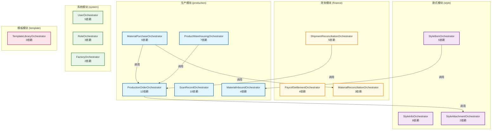
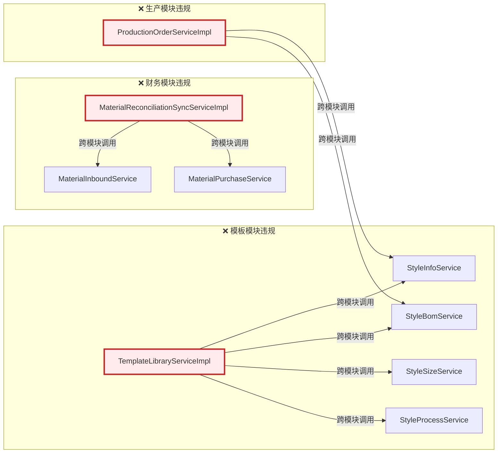
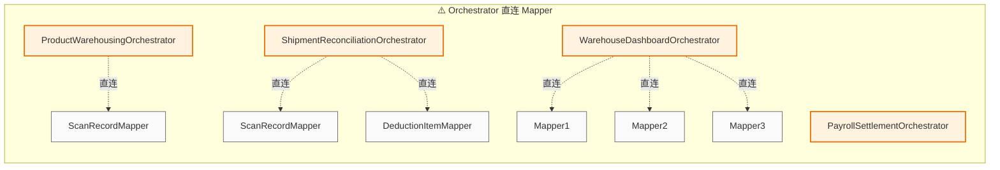
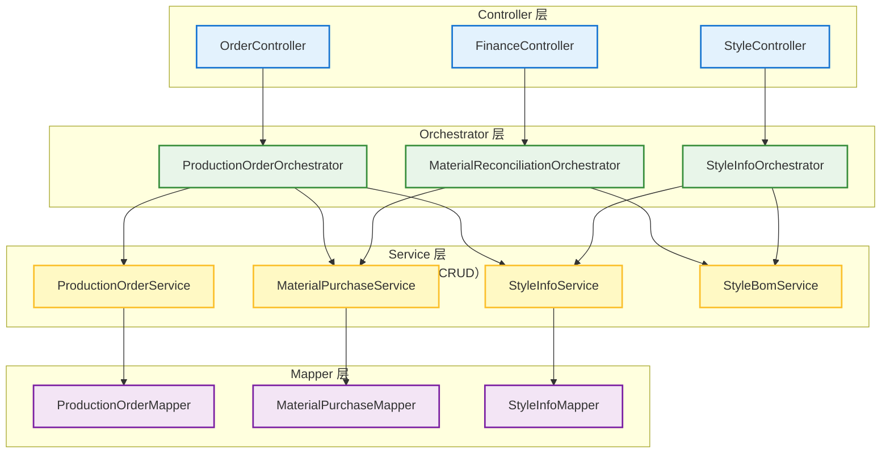
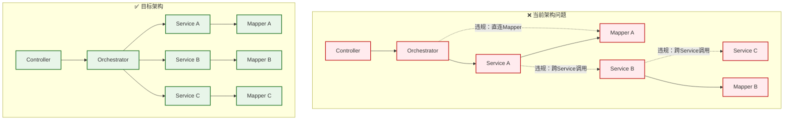
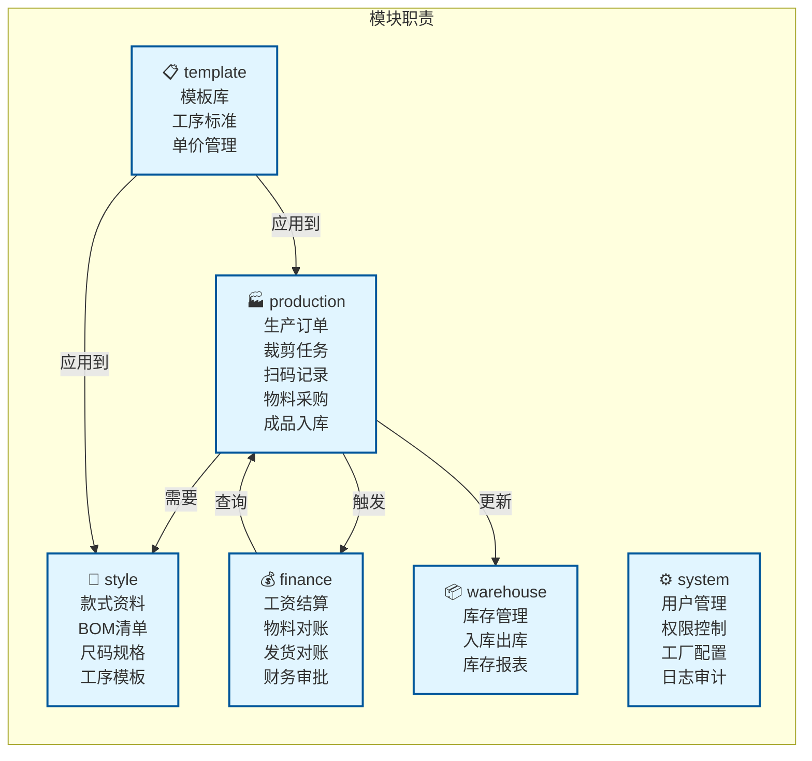
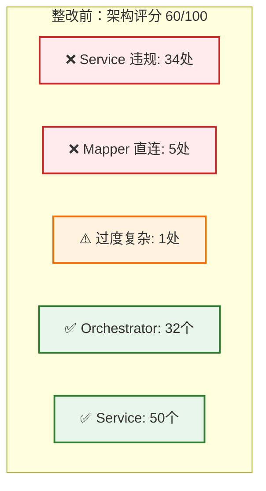
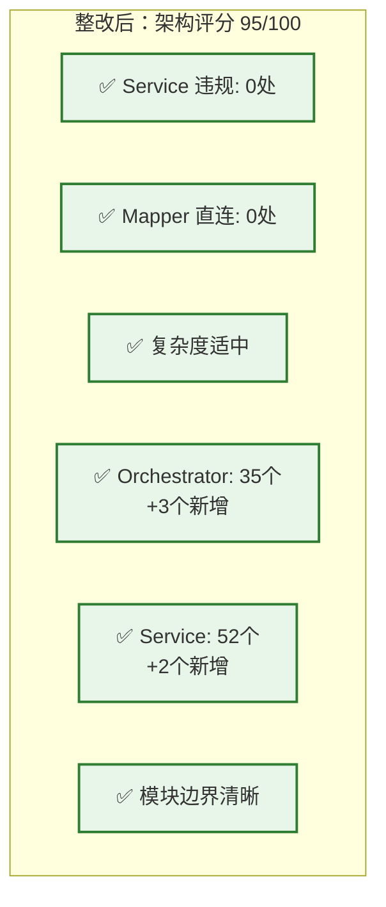

# 后端架构依赖关系可视化图谱

## 1. 核心模块依赖关系

## 2. Service 违规依赖链（红色警告）

## 3. Mapper 直连问题（橙色警告）

## 4. 理想架构（三层模型）

## 5. 当前架构问题可视化

## 6. 模块职责矩阵

## 7. 整改前后对比

### 整改前（当前状态）

### 整改后（目标状态）

## 图例说明

### 节点类型
- 🔧 **Orchestrator**: 业务协调层，负责跨Service协调
- 📦 **Service**: 单领域CRUD，负责数据访问
- 🗄️ **Mapper**: MyBatis Plus 数据访问层

### 连接类型
- **实线 (→)**: 正常的层级调用
- **虚线 (-.->)**: 违规调用（需要整改）

### 颜色标注
- 🔴 **红色**: 严重违规（Service 跨调用）
- 🟠 **橙色**: 中等问题（Mapper 直连）
- 🟡 **黄色**: 轻微问题（复杂度过高）
- 🟢 **绿色**: 符合规范

### 模块图标
- 🏭 **production**: 生产管理
- 💰 **finance**: 财务管理
- 👔 **style**: 款式管理
- ⚙️ **system**: 系统管理
- 📋 **template**: 模板管理
- 📦 **warehouse**: 仓储管理

---

**生成时间**: 2026-02-01  
**工具**: Mermaid Graph Generator v1.0  
**建议**: 在支持 Mermaid 的 Markdown 编辑器中查看（如 Typora, VS Code, GitHub）
