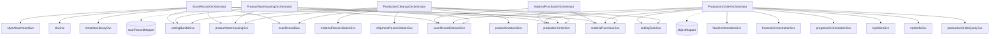

# 数据流转图

```mermaid
graph TB
    ScanRecordOrch[ScanRecordOrchestrator]
    ScanRecordOrch --> templateLibrarySvc
    ScanRecordOrch --> scanRecordSvc
    ScanRecordOrch --> productionOrderSvc
    ScanRecordOrch --> cuttingBundleSvc
    ScanRecordOrch --> productWarehousingSvc
    ScanRecordOrch --> scanRecordDomainSvc
    ScanRecordOrch --> materialPurchaseSvc
    ScanRecordOrch --> skuSvc
    ScanRecordOrch --> styleAttachmentSvc
    MaterialPurchaseOrch[MaterialPurchaseOrchestrator]
    MaterialPurchaseOrch --> materialPurchaseSvc
    MaterialPurchaseOrch --> productionOrderSvc
    MaterialPurchaseOrch --> scanRecordDomainSvc
    ProductionOrderOrch[ProductionOrderOrchestrator]
    ProductionOrderOrch --> productionOrderQuerySvc
    ProductionOrderOrch --> productionOrderSvc
    ProductionOrderOrch --> materialPurchaseSvc
    ProductionOrderOrch --> scanRecordDomainSvc
    ProductionOrderOrch --> styleInfoSvc
    ProductionOrderOrch --> styleSizeSvc
    ProductionOrderOrch --> cuttingTaskSvc
    ProductionOrderOrch --> progressOrchestrationSvc
    ProductionOrderOrch --> financeOrchestrationSvc
    ProductionOrderOrch --> flowOrchestrationSvc
    ProductionOrderOrch -.-> objectMap[(objectMapper)]
    ProductWarehousingOrch[ProductWarehousingOrchestrator]
    ProductWarehousingOrch --> productWarehousingSvc
    ProductWarehousingOrch --> productionOrderSvc
    ProductWarehousingOrch --> scanRecordDomainSvc
    ProductWarehousingOrch --> cuttingBundleSvc
    ProductWarehousingOrch -.-> scanRecordMap[(scanRecordMapper)]
    ProductionCleanupOrch[ProductionCleanupOrchestrator]
    ProductionCleanupOrch --> scanRecordSvc
    ProductionCleanupOrch --> materialPurchaseSvc
    ProductionCleanupOrch --> productionOrderSvc
    ProductionCleanupOrch --> productWarehousingSvc
    ProductionCleanupOrch --> productOutstockSvc
    ProductionCleanupOrch --> cuttingBundleSvc
    ProductionCleanupOrch --> shipmentReconciliationSvc
    ProductionCleanupOrch --> materialReconciliationSvc
    ProductionCleanupOrch --> cuttingTaskSvc

```
