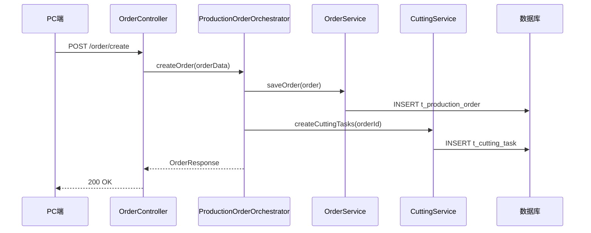

# 代码质量与业务优化工具完整指南

**最后更新**: 2026-01-24  
**适用系统**: 服装供应链管理系统（Java Spring Boot + React + 微信小程序）

---

## 📚 目录

1. [工具概览](#工具概览)
2. [代码质量检查工具](#代码质量检查工具)
3. [自动优化与补全工具](#自动优化与补全工具)
4. [业务逻辑优化工具](#业务逻辑优化工具)
5. [数据流转分析工具](#数据流转分析工具)
6. [一键安装指南](#一键安装指南)
7. [使用手册](#使用手册)
8. [性能优化实践](#性能优化实践)

---

## 🎯 工具概览

### 已配置的工具 ✅

| 工具 | 功能 | 状态 |
|------|------|------|
| ESLint | 代码质量检查 + 自动修复 | ✅ 已配置并强化 |
| Prettier | 代码格式化 | ✅ 已配置 |
| TypeScript | 类型检查 | ✅ 已配置 |
| Husky | Git hooks 自动化 | ✅ 已安装 |
| lint-staged | 预提交检查 | ✅ 已配置 |
| commitlint | 提交信息规范 | ✅ 已配置 |

### 推荐补充的工具（共30+个）

按优先级分类：

**P0 - 立即安装**（本周）:
- SonarLint - 实时代码质量检查
- depcheck - 检测未使用依赖
- TypeScript Hero - 自动导入管理
- rollup-plugin-visualizer - 打包分析

**P1 - 重要**（本月）:
- ts-prune - 检测未使用导出
- madge - 检测循环依赖
- Jaeger - 分布式追踪
- Grafana + Prometheus - 监控面板

**P2 - 可选**（按需）:
- SonarQube - 企业级代码分析
- Vitest - 单元测试
- Playwright - E2E 测试

---

## 🔍 代码质量检查工具

### 1. 前端代码质量

#### ESLint（已配置 ✅）
**当前问题统计**（2026-01-24）:
- 总警告: 2443 个
- any 类型: 2300 个 (94%)
- useEffect 依赖: 78 个 (3.2%)
- 空块: 60 个 (2.5%)
- 未使用变量: 2 个 (0.1%)

**强化后的规则**:
```json
{
  "rules": {
    "no-empty": "warn",
    "@typescript-eslint/no-unused-vars": ["warn", {
      "argsIgnorePattern": "^_",
      "varsIgnorePattern": "^_"
    }],
    "@typescript-eslint/no-explicit-any": "warn",
    "react-hooks/exhaustive-deps": "warn"
  }
}
```

**使用命令**:
```bash
cd frontend

# 检查所有问题
npm run lint

# 自动修复
npm run lint:fix

# 检查特定文件
npm run lint -- src/pages/Production/Cutting.tsx
```

#### SonarLint（推荐安装 ⭐⭐⭐⭐⭐）
**功能**:
- 实时代码质量检查（比 ESLint 更深入）
- 检测安全漏洞和性能问题
- 提供详细修复建议

**安装**:
```bash
code --install-extension SonarSource.sonarlint-vscode
```

**配置**: 开箱即用，无需额外配置

---

### 2. 后端代码质量

#### Checkstyle + SpotBugs + PMD
**功能**: Java 代码质量检查

**安装到 pom.xml**:
```xml
<!-- backend/pom.xml -->
<build>
  <plugins>
    <!-- Checkstyle -->
    <plugin>
      <groupId>org.apache.maven.plugins</groupId>
      <artifactId>maven-checkstyle-plugin</artifactId>
      <version>3.3.1</version>
      <configuration>
        <configLocation>google_checks.xml</configLocation>
      </configuration>
    </plugin>

    <!-- SpotBugs -->
    <plugin>
      <groupId>com.github.spotbugs</groupId>
      <artifactId>spotbugs-maven-plugin</artifactId>
      <version>4.8.3.0</version>
    </plugin>

    <!-- PMD -->
    <plugin>
      <groupId>org.apache.maven.plugins</groupId>
      <artifactId>maven-pmd-plugin</artifactId>
      <version>3.21.2</version>
    </plugin>
  </plugins>
</build>
```

**使用**:
```bash
cd backend

# 运行 Checkstyle
mvn checkstyle:check

# 运行 SpotBugs
mvn spotbugs:check

# 运行 PMD
mvn pmd:check

# 一次运行所有检查
mvn clean verify
```

---

## 🚀 自动优化与补全工具

### 1. 依赖管理工具

#### depcheck（⭐⭐⭐⭐⭐ 强烈推荐）
**功能**: 检测未使用的依赖和缺失的依赖

**安装**:
```bash
cd frontend
npm install -D depcheck
```

**使用**:
```bash
npx depcheck

# 或添加到 package.json
npm run check:deps
```

**预期输出**:
```
未使用的依赖:
  - some-old-package
  
缺失的依赖:
  - react-router-dom (在代码中使用但未在 package.json 中)
```

#### npm-check-updates（⭐⭐⭐⭐）
**功能**: 自动更新依赖到最新版本

**安装**:
```bash
npm install -g npm-check-updates
```

**使用**:
```bash
# 检查可更新的依赖
ncu

# 更新 package.json
ncu -u

# 安装新版本
npm install
```

#### madge（⭐⭐⭐⭐）
**功能**: 检测循环依赖，生成依赖图

**安装**:
```bash
cd frontend
npm install -D madge
```

**使用**:
```bash
# 检测循环依赖
npx madge --circular src/

# 生成依赖图
npx madge --image deps.svg src/
```

---

### 2. TypeScript 优化工具

#### ts-prune（⭐⭐⭐⭐）
**功能**: 检测未使用的 TypeScript 导出

**安装**:
```bash
cd frontend
npm install -D ts-prune
```

**使用**:
```bash
npx ts-prune

# 或添加到 package.json
npm run check:unused
```

#### TypeScript Hero（⭐⭐⭐⭐⭐）
**功能**: 自动导入管理、清理未使用导入

**安装**:
```bash
code --install-extension rbbit.typescript-hero
```

**快捷键**:
- `Ctrl+Alt+o` (macOS: `Cmd+Opt+o`) - 组织导入

**配置**: `.vscode/settings.json`
```json
{
  "typescriptHero.imports.organizeOnSave": true
}
```

---

### 3. 代码补全增强

#### IntelliCode（⭐⭐⭐⭐⭐）
**功能**: AI 辅助代码补全（基于机器学习）

**安装**:
```bash
code --install-extension VisualStudioExptTeam.vscodeintellicode
```

**优势**: 
- 优先推荐最可能的代码
- 学习你的编码习惯
- 支持多语言

#### JS Refactor（⭐⭐⭐⭐）
**功能**: 自动重构 JavaScript/TypeScript

**安装**:
```bash
code --install-extension cmstead.jsrefactor
```

**功能**:
- 提取函数/变量
- 重命名符号
- 内联变量
- 转换箭头函数 ↔ 普通函数

---

### 4. 性能分析工具

#### rollup-plugin-visualizer（⭐⭐⭐⭐⭐）
**功能**: 可视化分析打包体积

**安装**:
```bash
cd frontend
npm install -D rollup-plugin-visualizer
```

**配置**: `vite.config.ts`
```typescript
import { visualizer } from 'rollup-plugin-visualizer';

export default defineConfig({
  plugins: [
    visualizer({
      open: true,
      gzipSize: true,
      brotliSize: true,
      filename: 'dist/stats.html'
    })
  ]
});
```

**使用**:
```bash
npm run build
# 自动打开 stats.html
```

---

## 📊 业务逻辑优化工具

### 1. 业务流程可视化

#### PlantUML / Mermaid（⭐⭐⭐⭐⭐）
**功能**: 从代码自动生成流程图、时序图

**安装**:
```bash
# VS Code 扩展
code --install-extension jebbs.plantuml
code --install-extension bierner.markdown-mermaid

# npm 包
cd frontend
npm install -D @mermaid-js/mermaid-cli
```

**示例**: 订单流程图


**自动生成**: 使用 `scripts/analyze-business-flow.js` 自动生成

---

### 2. 复杂度分析（已创建脚本 ✅）

#### analyze-complexity.sh
**功能**: 分析所有 Orchestrator 和 Service 的代码复杂度

**位置**: `scripts/analyze-complexity.sh`

**使用**:
```bash
./scripts/analyze-complexity.sh
```

**输出示例**:
```
📋 分析 Orchestrator 层
======================================

✅ ProductionOrderOrchestrator
   📏 总行数: 245
   🔧 方法数: 12 (public: 8, private: 4)
   📊 平均行数/方法: 20
   🔗 服务调用: 4

⚠️ ShipmentReconciliationOrchestrator
   📏 总行数: 567
   🔧 方法数: 18
   📊 平均行数/方法: 31
   🔗 服务调用: 8
   💡 建议: 服务调用过多，考虑重构

❌ CuttingTaskOrchestrator
   📏 总行数: 892
   🔧 方法数: 25
   📊 平均行数/方法: 35
   🔗 服务调用: 15
   💡 建议: 文件过大，考虑拆分
   💡 建议: 服务调用过多，考虑重构
```

**评判标准**:
- ✅ 良好: 行数<500, 平均方法<50行, 服务调用<10
- ⚠️ 警告: 行数500-800, 平均方法50-80行, 服务调用10-15
- ❌ 严重: 行数>800, 平均方法>80行, 服务调用>15

---

### 3. 业务流程分析（已创建脚本 ✅）

#### analyze-business-flow.js
**功能**: 分析 Orchestrator 中的服务调用链路

**位置**: `scripts/analyze-business-flow.js`

**使用**:
```bash
node scripts/analyze-business-flow.js
```

**输出**:
1. **控制台报告**: 每个 Orchestrator 调用了哪些 Service
2. **流转图**: 自动生成 `docs/diagrams/data-flow.md`
3. **优化建议**: 哪些需要优化

**示例输出**:
```
📋 订单管理
========================================

⚠️ ProductionOrderOrchestrator
   📊 总调用: 8 (Service: 5, Mapper: 3)
   🔗 依赖服务 (5):
      - OrderService: 2 次
      - CuttingService: 1 次
      - FinanceService: 1 次
      - BundleService: 1 次
   💾 数据访问 (3):
      - OrderMapper: 2 次
      - SkuMapper: 1 次
   💡 建议: 关注性能，考虑合并相似调用
```

---

## 🔗 数据流转分析工具

### 1. 分布式追踪

#### Jaeger + OpenTelemetry（⭐⭐⭐⭐⭐）
**功能**: 追踪请求在系统中的完整流转路径

**快速启动**:
```bash
# 启动 Jaeger（Docker）
cd deployment
docker-compose -f docker-compose-dev.yml up -d jaeger
```

**集成到 Spring Boot**:
```xml
<!-- backend/pom.xml -->
<dependency>
    <groupId>io.opentelemetry.instrumentation</groupId>
    <artifactId>opentelemetry-spring-boot-starter</artifactId>
    <version>2.2.0</version>
</dependency>
```

```yaml
# application.yml
management:
  tracing:
    sampling:
      probability: 1.0
  otlp:
    tracing:
      endpoint: http://localhost:4318/v1/traces
```

**访问**: http://localhost:16686

**效果**: 
- 看到订单创建的完整链路
- 每个服务的耗时
- 发现性能瓶颈

---

### 2. 性能监控

#### Spring Boot Actuator + Micrometer（⭐⭐⭐⭐⭐）
**功能**: 监控业务指标、性能指标

**配置**: `application.yml`
```yaml
management:
  endpoints:
    web:
      exposure:
        include: health,metrics,prometheus,mappings,beans
  metrics:
    tags:
      application: fashion-supplychain
```

**使用**:
```bash
# 查看所有 HTTP 请求统计
curl http://localhost:8080/actuator/metrics/http.server.requests

# 查看数据库连接池
curl http://localhost:8080/actuator/metrics/hikaricp.connections

# 查看 JVM 内存
curl http://localhost:8080/actuator/metrics/jvm.memory.used
```

---

#### Grafana + Prometheus（⭐⭐⭐⭐⭐）
**功能**: 实时监控面板

**启动**:
```bash
cd deployment
docker-compose -f docker-compose-monitoring.yml up -d
```

**访问**:
- Grafana: http://localhost:3000 (admin/admin)
- Prometheus: http://localhost:9090

**配置**: `deployment/prometheus.yml`
```yaml
global:
  scrape_interval: 15s

scrape_configs:
  - job_name: 'spring-boot-backend'
    metrics_path: '/actuator/prometheus'
    static_configs:
      - targets: ['host.docker.internal:8080']
```

**效果**: 实时监控
- 订单创建速率
- API 响应时间
- 数据库查询性能
- JVM 内存使用

---

### 3. 前端性能监控（已创建工具 ✅）

#### performanceMonitor.ts
**位置**: `frontend/src/utils/performanceMonitor.ts`

**功能**:
- 监控 API 调用性能
- 监控业务操作耗时
- 自动检测慢操作
- 生成性能报告

**使用示例**:
```typescript
import PerformanceMonitor from '@/utils/performanceMonitor';

// 1. 监控 API 调用
const fetchOrders = async () => {
  return PerformanceMonitor.trackApiCall('获取订单列表', async () => {
    return await api.get('/order/list');
  });
};

// 2. 监控同步操作
PerformanceMonitor.track('计算订单统计', () => {
  const stats = calculateOrderStats(orders);
  setStats(stats);
});

// 3. 监控异步操作
await PerformanceMonitor.trackAsync('处理裁剪数据', async () => {
  await processCuttingData(data);
});

// 4. 查看报告（在控制台）
performanceMonitor.printReport();

// 5. 获取最慢的操作
performanceMonitor.getSlowestOperations(10);

// 6. 导出数据
const json = performanceMonitor.exportData();
```

**自动功能**（开发环境）:
- 每2分钟自动输出报告
- 慢操作自动警告（>1s）
- 暴露到全局 `window.performanceMonitor`

---

### 4. 数据库查询优化

#### MySQL 慢查询分析
**配置**: `deployment/docker-compose-simple.yml`
```yaml
services:
  mysql:
    command: 
      - --slow-query-log=1
      - --slow-query-log-file=/var/log/mysql/slow.log
      - --long-query-time=1
      - --log-queries-not-using-indexes=1
```

**分析慢查询**:
```bash
# 导出慢查询日志
docker exec fashion-mysql-simple cat /var/log/mysql/slow.log > slow.log

# 使用 pt-query-digest 分析
brew install percona-toolkit
pt-query-digest slow.log > slow-query-report.txt

# 查看报告
cat slow-query-report.txt
```

#### MyBatis Plus 性能插件
**配置**: 开发环境启用
```java
@Configuration
@Profile("dev")
public class MybatisPlusConfig {
    @Bean
    public MybatisPlusInterceptor mybatisPlusInterceptor() {
        MybatisPlusInterceptor interceptor = new MybatisPlusInterceptor();
        interceptor.addInnerInterceptor(new PerformanceInterceptor());
        return interceptor;
    }
}
```

---

## 🛠️ 一键安装指南

### 方案一: 自动安装脚本（推荐）

#### 1. 安装代码优化工具
**位置**: `scripts/setup-optimization-tools.sh`

```bash
./scripts/setup-optimization-tools.sh
```

**安装内容**:
- npm 依赖: depcheck, madge, ts-prune, rollup-plugin-visualizer
- VS Code 扩展: SonarLint, TypeScript Hero, IntelliCode
- package.json 脚本: check:unused, check:deps, check:circular, check:all
- .vscode/settings.json 配置

#### 2. 安装业务分析工具
**创建**: `scripts/setup-business-analysis.sh`

```bash
#!/bin/bash

echo "🚀 安装业务逻辑分析工具..."

# PlantUML / Mermaid
code --install-extension jebbs.plantuml
code --install-extension bierner.markdown-mermaid

# 给脚本添加执行权限
chmod +x scripts/analyze-complexity.sh
chmod +x scripts/analyze-business-flow.js

# 启动监控工具（Docker）
echo "📊 启动监控服务..."
cd deployment
docker-compose -f docker-compose-monitoring.yml up -d

echo "✅ 安装完成！"
echo "🔗 访问地址:"
echo "  - Grafana:   http://localhost:3000 (admin/admin)"
echo "  - Prometheus: http://localhost:9090"
```

---

### 方案二: 手动安装

#### 前端工具安装
```bash
cd frontend

# 依赖管理工具
npm install -D depcheck madge ts-prune npm-check-updates

# 性能分析工具
npm install -D rollup-plugin-visualizer

# 测试工具（可选）
npm install -D vitest @testing-library/react @testing-library/jest-dom
```

#### VS Code 扩展安装
```bash
# 代码质量
code --install-extension SonarSource.sonarlint-vscode

# TypeScript 增强
code --install-extension rbbit.typescript-hero

# 代码补全
code --install-extension VisualStudioExptTeam.vscodeintellicode

# 重构工具
code --install-extension cmstead.jsrefactor

# 流程图
code --install-extension jebbs.plantuml
code --install-extension bierner.markdown-mermaid
```

#### package.json 脚本添加
在 `frontend/package.json` 添加:
```json
{
  "scripts": {
    "check:unused": "ts-prune",
    "check:deps": "depcheck",
    "check:circular": "madge --circular src/",
    "check:all": "npm run lint && npm run type-check && npm run check:unused && npm run check:deps && npm run check:circular",
    "update:deps": "ncu -u && npm install",
    "analyze": "vite build && vite-bundle-visualizer"
  }
}
```

---

## 📖 使用手册

### 日常开发工作流

#### 每日开发
```bash
# 1. 开发前检查
npm run check:all

# 2. 编码（VS Code 自动提示和修复）
# - IntelliCode 智能补全
# - SonarLint 实时检查
# - TypeScript Hero 自动导入

# 3. 保存时自动执行
# - Prettier 格式化
# - ESLint 自动修复
# - 组织导入

# 4. 提交代码
git commit -m "feat: 添加订单导出功能"
# Husky 自动运行:
#   - lint-staged (ESLint + Prettier)
#   - commitlint (检查提交信息格式)
```

#### 每周维护
```bash
# 1. 检查未使用的代码
npm run check:unused

# 2. 清理未使用的依赖
npm run check:deps

# 3. 检查循环依赖
npm run check:circular

# 4. 更新依赖
npm run update:deps

# 5. 分析后端复杂度
./scripts/analyze-complexity.sh

# 6. 分析业务流程
node scripts/analyze-business-flow.js
```

#### 每月优化
```bash
# 1. 分析打包体积
npm run analyze

# 2. 查看性能报告
# 在浏览器控制台:
performanceMonitor.printReport()

# 3. 检查慢查询
docker exec fashion-mysql-simple cat /var/log/mysql/slow.log > slow.log
pt-query-digest slow.log

# 4. 查看监控面板
# 访问 http://localhost:3000 (Grafana)
```

---

### 快速命令参考

#### 前端检查
```bash
# 代码质量
npm run lint              # 检查所有问题
npm run lint:fix          # 自动修复
npm run type-check        # TypeScript 类型检查

# 依赖检查
npm run check:unused      # 未使用的导出
npm run check:deps        # 未使用的依赖
npm run check:circular    # 循环依赖

# 综合检查
npm run check:all         # 运行所有检查

# 性能分析
npm run analyze           # 打包分析
```

#### 后端检查
```bash
cd backend

# 代码质量
mvn checkstyle:check      # 代码风格
mvn spotbugs:check        # Bug 检测
mvn pmd:check             # 代码分析

# 综合检查
mvn clean verify          # 所有检查

# 业务逻辑分析
cd ..
./scripts/analyze-complexity.sh        # 复杂度分析
node scripts/analyze-business-flow.js  # 流程分析
```

---

## 🎯 性能优化实践

### 针对你的系统优化清单

#### 1. Orchestrator 层优化

**检查方法**:
```bash
./scripts/analyze-complexity.sh
```

**优化目标**:
- ✅ 单个 Orchestrator < 500 行
- ✅ 单个方法 < 50 行
- ✅ 依赖的 Service < 5 个

**常见问题与解决方案**:

| 问题 | 解决方案 |
|------|---------|
| 文件过大 (>500行) | 拆分为多个 Orchestrator，按业务领域划分 |
| 方法过长 (>50行) | 提取私有方法，使用策略模式 |
| 服务调用过多 (>10) | 合并相似调用，使用批量操作，引入领域事件 |
| 重复代码 | 提取到基类或工具类 |

**示例**: 拆分大的 Orchestrator
```java
// 原来: CuttingTaskOrchestrator (800+ 行)
// 拆分为:
// - CuttingCreationOrchestrator (创建裁剪单)
// - CuttingDistributionOrchestrator (分配裁剪任务)
// - CuttingCompletionOrchestrator (完成裁剪)
```

---

#### 2. 数据流转优化

**检查方法**:
```bash
# 启动 Jaeger
docker-compose -f deployment/docker-compose-dev.yml up -d jaeger

# 访问 http://localhost:16686
# 创建订单，查看完整链路
```

**关注指标**:
- 订单创建总耗时 (目标: <500ms)
- 各服务耗时分布
- N+1 查询问题

**优化方向**:

1. **批量操作替代循环查询**
```java
// ❌ 不好: N+1 查询
for (Order order : orders) {
    List<Sku> skus = skuMapper.selectByOrderId(order.getId());
    // ...
}

// ✅ 好: 批量查询
List<Long> orderIds = orders.stream().map(Order::getId).collect(Collectors.toList());
Map<Long, List<Sku>> skuMap = skuMapper.selectByOrderIds(orderIds)
    .stream()
    .collect(Collectors.groupingBy(Sku::getOrderId));
```

2. **使用 MyBatis Plus 批量插入**
```java
// ❌ 不好: 循环插入
for (CuttingTask task : tasks) {
    cuttingTaskMapper.insert(task);
}

// ✅ 好: 批量插入
cuttingTaskService.saveBatch(tasks);
```

3. **添加索引**
```sql
-- 检查慢查询日志，为常用查询字段添加索引
CREATE INDEX idx_order_no ON t_production_order(order_no);
CREATE INDEX idx_style_no ON t_production_order(style_no);
CREATE INDEX idx_factory_id ON t_production_order(factory_id);
```

---

#### 3. 前端性能优化

**检查方法**:
```typescript
// 在关键页面启用监控
import PerformanceMonitor from '@/utils/performanceMonitor';

useEffect(() => {
  PerformanceMonitor.trackApiCall('订单列表加载', async () => {
    const data = await fetchOrders();
    setOrders(data);
  });
}, []);

// 查看报告
console.table(performanceMonitor.getReport());
```

**优化目标**:
- ✅ 页面加载 < 2s
- ✅ API 调用 < 1s
- ✅ 交互响应 < 200ms (INP)

**常见优化**:

1. **代码分割**
```typescript
// 路由级懒加载
const Cutting = lazy(() => import('./pages/Production/Cutting'));
const OrderList = lazy(() => import('./pages/OrderManagement'));
```

2. **虚拟滚动**（大列表）
```typescript
// 使用 react-window 或 react-virtualized
import { FixedSizeList } from 'react-window';

<FixedSizeList
  height={600}
  itemCount={orders.length}
  itemSize={50}
  width="100%"
>
  {({ index, style }) => (
    <div style={style}>{orders[index].orderNo}</div>
  )}
</FixedSizeList>
```

3. **请求合并**
```typescript
// ❌ 不好: 多次请求
const [orders, setOrders] = useState([]);
const [factories, setFactories] = useState([]);
const [materials, setMaterials] = useState([]);

useEffect(() => {
  fetchOrders().then(setOrders);
  fetchFactories().then(setFactories);
  fetchMaterials().then(setMaterials);
}, []);

// ✅ 好: 合并请求
useEffect(() => {
  Promise.all([
    fetchOrders(),
    fetchFactories(),
    fetchMaterials()
  ]).then(([orders, factories, materials]) => {
    setOrders(orders);
    setFactories(factories);
    setMaterials(materials);
  });
}, []);
```

---

#### 4. 数据库优化

**慢查询分析**:
```bash
# 导出慢查询日志
docker exec fashion-mysql-simple cat /var/log/mysql/slow.log > slow.log

# 分析
pt-query-digest slow.log > report.txt

# 查看 TOP 10 慢查询
head -100 report.txt
```

**优化策略**:

1. **添加索引**
```sql
-- 分析查询计划
EXPLAIN SELECT * FROM t_production_order WHERE style_no = 'ST001';

-- 添加索引
CREATE INDEX idx_style_no ON t_production_order(style_no);

-- 再次检查
EXPLAIN SELECT * FROM t_production_order WHERE style_no = 'ST001';
```

2. **查询优化**
```sql
-- ❌ 不好: SELECT *
SELECT * FROM t_production_order WHERE ...;

-- ✅ 好: 只选择需要的字段
SELECT id, order_no, style_no, total_quantity FROM t_production_order WHERE ...;

-- ❌ 不好: 子查询
SELECT * FROM t_production_order WHERE id IN (
    SELECT order_id FROM t_cutting_task WHERE status = 'COMPLETED'
);

-- ✅ 好: JOIN
SELECT o.* FROM t_production_order o
INNER JOIN t_cutting_task c ON o.id = c.order_id
WHERE c.status = 'COMPLETED';
```

---

## 📊 VS Code 最佳配置

创建或更新 `.vscode/settings.json`:

```json
{
  "// 自动保存和格式化": "",
  "editor.formatOnSave": true,
  "editor.codeActionsOnSave": {
    "source.fixAll.eslint": "explicit",
    "source.organizeImports": "explicit"
  },

  "// TypeScript 增强": "",
  "typescript.suggest.autoImports": true,
  "typescript.updateImportsOnFileMove.enabled": "always",
  "typescript.inlayHints.parameterNames.enabled": "all",
  "typescript.inlayHints.variableTypes.enabled": true,

  "// ESLint 配置": "",
  "eslint.validate": [
    "javascript",
    "javascriptreact",
    "typescript",
    "typescriptreact"
  ],
  "eslint.codeActionsOnSave.mode": "all",

  "// Prettier 配置": "",
  "prettier.requireConfig": true,
  "[typescript]": {
    "editor.defaultFormatter": "esbenp.prettier-vscode"
  },
  "[typescriptreact]": {
    "editor.defaultFormatter": "esbenp.prettier-vscode"
  },

  "// 文件排除（提高性能）": "",
  "files.watcherExclude": {
    "**/node_modules/**": true,
    "**/dist/**": true,
    "**/build/**": true,
    "**/.git/**": true
  },

  "// 搜索排除": "",
  "search.exclude": {
    "**/node_modules": true,
    "**/dist": true,
    "**/build": true,
    "**/.git": true,
    "**/logs": true
  }
}
```

---

## 🚦 三周优化计划

### 第一周：基础监控

**目标**: 建立监控体系

**任务清单**:
- [x] 安装并配置所有代码质量工具
- [ ] 启动 Prometheus + Grafana
- [ ] 配置 Spring Boot Actuator
- [ ] 启用 MySQL 慢查询日志
- [ ] 运行复杂度分析脚本
- [ ] 前端集成 performanceMonitor

**验收标准**:
- ✅ Grafana 面板正常显示
- ✅ 能查看实时 API 响应时间
- ✅ 慢查询日志正常记录
- ✅ 知道哪些 Orchestrator 需要优化

---

### 第二周：深度分析

**目标**: 发现并记录性能问题

**任务清单**:
- [ ] 集成 Jaeger 分布式追踪
- [ ] 运行业务流程分析
- [ ] 分析最慢的 10 个接口
- [ ] 分析前端打包体积
- [ ] 检测循环依赖
- [ ] 检测未使用代码

**验收标准**:
- ✅ 能追踪订单创建完整链路
- ✅ 知道哪个服务最慢
- ✅ 知道打包体积的组成
- ✅ 列出需要优化的优先级清单

---

### 第三周：持续优化

**目标**: 实施优化并建立基线

**任务清单**:
- [ ] 优化最慢的 3 个接口
- [ ] 优化最复杂的 2 个 Orchestrator
- [ ] 添加必要的数据库索引
- [ ] 优化前端打包配置
- [ ] 建立性能基线（P95 响应时间）
- [ ] 编写优化文档

**验收标准**:
- ✅ P95 响应时间 < 500ms
- ✅ 打包体积减少 20%
- ✅ 无严重级别的复杂度问题
- ✅ 团队知道如何使用这些工具

---

## 📝 附录

### A. 完整工具清单

| 类别 | 工具 | 优先级 | 状态 |
|------|------|--------|------|
| **代码质量** | ESLint | P0 | ✅ 已配置 |
| | Prettier | P0 | ✅ 已配置 |
| | SonarLint | P0 | 推荐安装 |
| | Checkstyle | P1 | 待安装 |
| | SpotBugs | P1 | 待安装 |
| **自动化** | Husky | P0 | ✅ 已安装 |
| | lint-staged | P0 | ✅ 已配置 |
| | commitlint | P0 | ✅ 已配置 |
| **依赖管理** | depcheck | P0 | 推荐安装 |
| | madge | P0 | 推荐安装 |
| | ts-prune | P1 | 推荐安装 |
| | npm-check-updates | P1 | 可选 |
| **代码补全** | IntelliCode | P0 | 推荐安装 |
| | TypeScript Hero | P0 | 推荐安装 |
| | JS Refactor | P1 | 可选 |
| **性能分析** | rollup-plugin-visualizer | P0 | 推荐安装 |
| | performanceMonitor | P0 | ✅ 已创建 |
| | Jaeger | P1 | 可选 |
| **业务分析** | analyze-complexity.sh | P0 | ✅ 已创建 |
| | analyze-business-flow.js | P0 | ✅ 已创建 |
| | PlantUML/Mermaid | P1 | 推荐安装 |
| **监控** | Grafana + Prometheus | P1 | 可选 |
| | Spring Boot Actuator | P1 | 可选 |
| **测试** | Vitest | P2 | 可选 |
| | Playwright | P2 | 可选 |

### B. 快速参考链接

- **文档位置**: `docs/代码质量工具完整指南.md`
- **脚本位置**: 
  - `scripts/setup-optimization-tools.sh`
  - `scripts/analyze-complexity.sh`
  - `scripts/analyze-business-flow.js`
- **前端工具**: `frontend/src/utils/performanceMonitor.ts`
- **配置文件**:
  - `frontend/.eslintrc.json`
  - `frontend/commitlint.config.js`
  - `.vscode/settings.json`

---

**创建日期**: 2026-01-24  
**维护者**: 开发团队  
**版本**: 1.0.0
