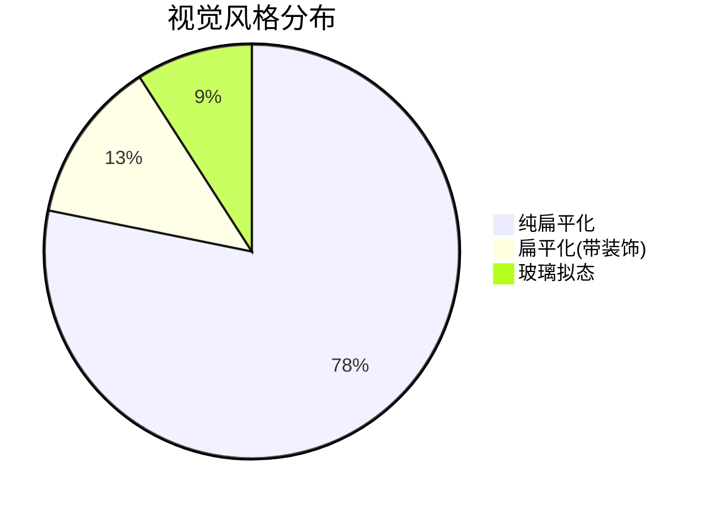
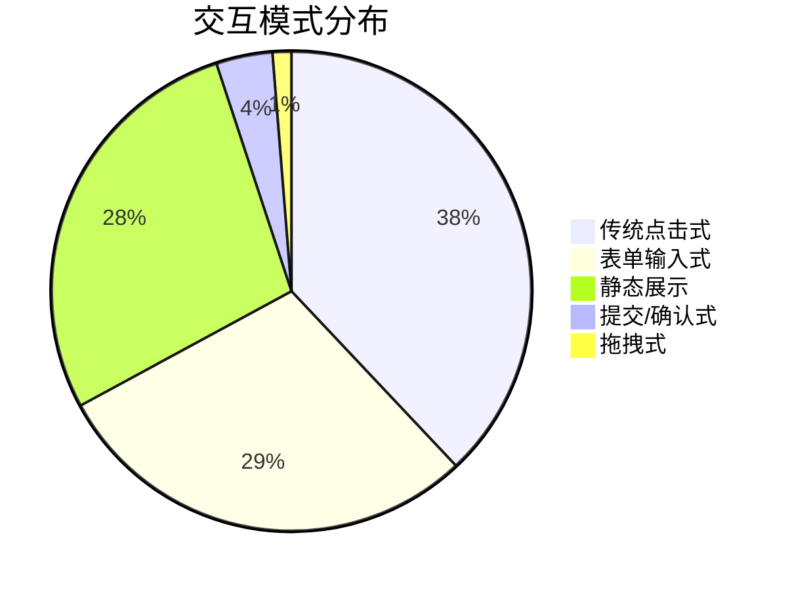
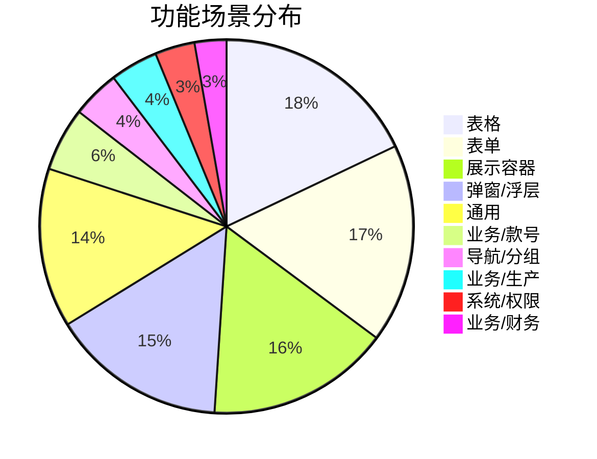

# 全站风格审计报告

生成时间：2026-01-17T14:11:53.717Z

## 审计范围
| 总文件 | 代码文件 | TSX | TS | CSS | 页面 | 组件 |
| --- | --- | --- | --- | --- | --- | --- |
| 64 | 55 | 40 | 15 | 9 | 29 | 7 |

## 风格分类标准（本次使用的可量化信号）

| 分类 | 特征 |
| --- | --- |
| 纯扁平化 | 无明显渐变/阴影/动画/毛玻璃信号 |
| 扁平化(带装饰) | 存在渐变/阴影/动画中的一种或多种，但非玻璃/新拟态/拟物 |
| 拟物化 | 渐变+阴影+（文字阴影或动画）倾向，装饰更强 |
| 新拟态 | box-shadow 同时出现明暗两侧阴影（含负偏移），更接近浮雕感 |
| 玻璃拟态 | backdrop-filter 或 blur 信号（半透明/模糊背景） |

## 视觉风格分布
| name | count |
| --- | --- |
| 纯扁平化 | 43 |
| 扁平化(带装饰) | 7 |
| 玻璃拟态 | 5 |

## 交互模式分布
| name | count |
| --- | --- |
| 传统点击式 | 30 |
| 表单输入式 | 23 |
| 静态展示 | 22 |
| 提交/确认式 | 3 |
| 拖拽式 | 1 |

## 功能场景分布
| name | count |
| --- | --- |
| 表格 | 26 |
| 表单 | 25 |
| 展示容器 | 23 |
| 弹窗/浮层 | 22 |
| 通用 | 20 |
| 业务/款号 | 8 |
| 导航/分组 | 6 |
| 业务/生产 | 6 |
| 系统/权限 | 5 |
| 业务/财务 | 4 |
| 导航/布局 | 1 |
| 展示/看板 | 1 |
| 登录/认证 | 1 |

## 基础 UI 组件使用频率（Ant Design imports Top 30）
| name | count |
| --- | --- |
| message | 31 |
| Space | 30 |
| Button | 28 |
| Input | 23 |
| Tag | 23 |
| Card | 23 |
| Select | 22 |
| Form | 20 |
| Modal | 13 |
| InputNumber | 13 |
| Row | 11 |
| Col | 11 |
| Dropdown | 6 |
| DatePicker | 6 |
| Tabs | 6 |
| Table | 5 |
| Typography | 5 |
| Spin | 4 |
| Alert | 4 |
| Upload | 4 |
| Popconfirm | 4 |
| Statistic | 3 |
| Collapse | 3 |
| Segmented | 3 |
| Navigate | 2 |
| useLocation | 2 |
| Drawer | 2 |
| Tooltip | 2 |
| Tree | 2 |
| BrowserRouter | 1 |

## 弹窗/浮层相关调用频率
| name | count |
| --- | --- |
| message | 519 |
| ResizableModal | 80 |
| Modal | 51 |
| Popconfirm | 22 |
| Drawer | 8 |

## 风格冲突/不一致实例（候选）
| type | file | visual | score | reason |
| --- | --- | --- | --- | --- |
| 页面装饰强度偏离 | pages/Login/index.tsx | 玻璃拟态 | 10 | 使用 backdrop-filter/blur，风格更偏玻璃拟态；存在渐变背景；存在动画效果；存在明显阴影 |
| 页面装饰强度偏离 | pages/Production/ProgressDetail.tsx | 玻璃拟态 | 10 | 使用 backdrop-filter/blur，风格更偏玻璃拟态；存在渐变背景；存在动画效果；存在明显阴影 |
| 页面装饰强度偏离 | pages/StyleAudit/index.tsx | 玻璃拟态 | 5 | 使用 backdrop-filter/blur，风格更偏玻璃拟态；存在渐变背景 |

## 截图集获取方式

- 打开 /style-audit 页面，使用“打印/导出”生成 PDF（可作为截图集）。
- 页面内提供基础组件、布局、弹窗与特殊交互组件的统一展示区，便于对比。

## 本次整改记录（2026-01-17）

- 移除无意义的页面 wrapper class，改为使用通用布局类（如 `page-card`、`filter-card`）。
- 清理生产模块旧样式范围选择器，删除无引用样式（如 `.warehousing-page`、`.material-purchase-page`）。
- 修复 ResizableModal 组件引用路径，确保构建与运行稳定。
