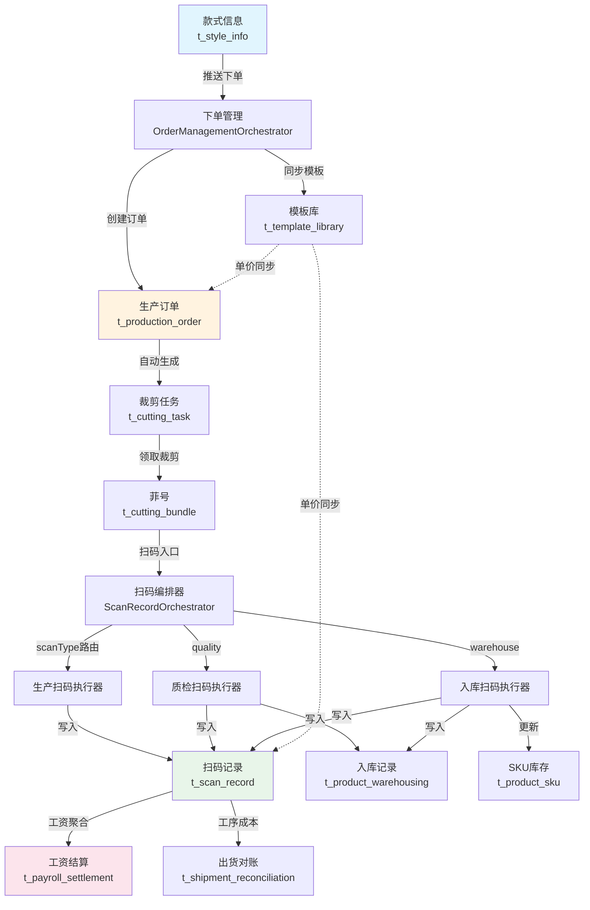
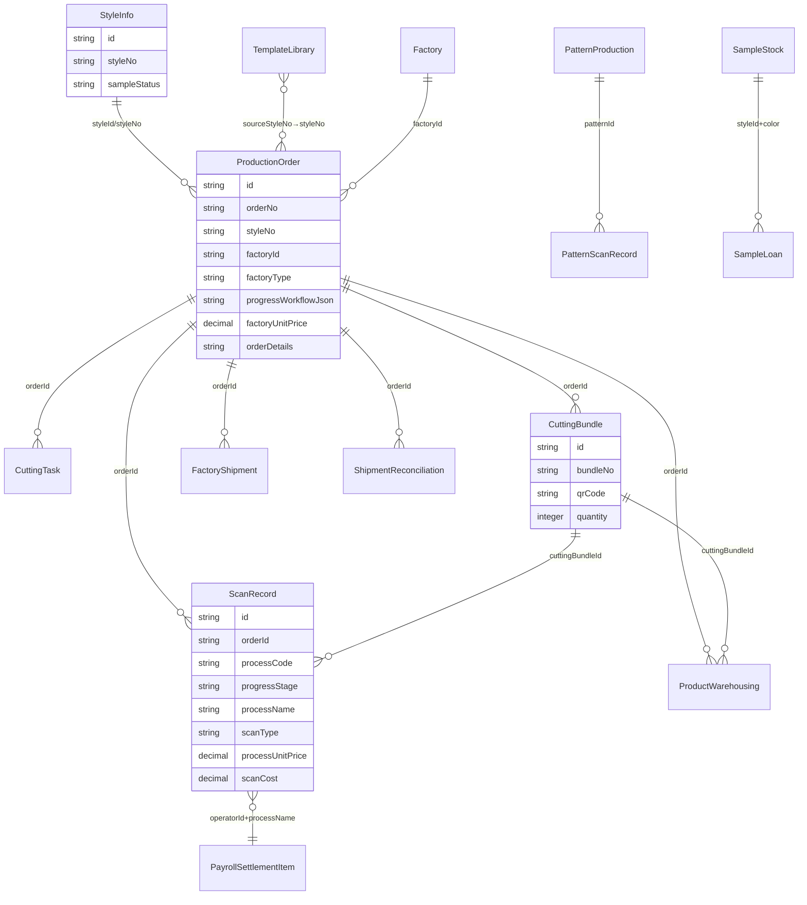

# 服装供应链管理系统 — 全系统数据流转与架构分析

> 生成日期：2026-04-23  
> 范围：全系统多端业务逻辑、数据流转路径、上下游关联、问题与风险

---

## 目录

1. [系统架构总览](#1-系统架构总览)
2. [核心业务数据流转图](#2-核心业务数据流转图)
3. [多端系统关系图](#3-多端系统关系图)
4. [核心业务流程详解](#4-核心业务流程详解)
5. [外发工厂独立流程](#5-外发工厂独立流程)
6. [样衣扫码双表同步流程](#6-样衣扫码双表同步流程)
7. [数据库实体关系图](#7-数据库实体关系图)
8. [多租户与工厂隔离机制](#8-多租户与工厂隔离机制)
9. [问题与风险清单](#9-问题与风险清单)
10. [已修复问题汇总](#10-已修复问题汇总)

---

## 1. 系统架构总览

### 1.1 技术栈

| 层级 | 技术 |
|------|------|
| 后端 | Spring Boot + MyBatis-Plus + Flyway + Redis |
| PC前端 | React + TypeScript + Ant Design |
| 小程序 | 微信原生小程序 |
| H5 | 与小程序共享代码（sync-miniprogram.mjs 同步） |
| Flutter | Dart + Flutter SDK |
| 实时通信 | WebSocket + SSE |
| 数据库 | MySQL 8.x |
| AI | Azure OpenAI + MCP Tools |

### 1.2 系统分层

```
┌─────────────────────────────────────────────────────────┐
│                    客户端层 (4端)                         │
│  PC(React) │ 小程序(微信) │ H5(移动浏览器) │ Flutter      │
└──────┬──────────┬──────────────┬────────────┬───────────┘
       │          │              │            │
       ▼          ▼              ▼            ▼
┌─────────────────────────────────────────────────────────┐
│                    API 网关层                             │
│  Spring Security + JWT + TenantInterceptor              │
│  HMAC签名验证 + 防重复 + 限流                             │
└────────────────────────┬────────────────────────────────┘
                         │
                         ▼
┌─────────────────────────────────────────────────────────┐
│                    业务编排层                             │
│  Orchestrator → Executor → Helper → Service             │
│  事件驱动：TemplatePriceChangedEvent → Listener          │
└────────────────────────┬────────────────────────────────┘
                         │
                         ▼
┌─────────────────────────────────────────────────────────┐
│                    数据持久层                             │
│  MyBatis-Plus → MySQL + Redis Cache                     │
│  Flyway Migration + DbColumnRepairRunner                │
└─────────────────────────────────────────────────────────┘
```

---

## 2. 核心业务数据流转图

### 2.1 大货生产全链路



### 2.2 扫码类型链路

```
cutting → production → quality → warehouse
   │          │           │          │
   ▼          ▼           ▼          ▼
ProductionScanExecutor  QualityScanExecutor  WarehouseScanExecutor
   │          │           │          │
   └──────────┴───────────┴──────────┘
              │
              ▼
         ScanRecord (t_scan_record)
              │
    ┌─────────┼─────────┐
    ▼         ▼         ▼
progressStage  processName  processCode
(父节点)     (子工序名)   (工序编号)
```

### 2.3 工序单价同步链路

```
模板保存/更新
  ├── saveProcessPriceTemplate() → 发布 TemplatePriceChangedEvent ✅
  ├── create() / save() / update() → 发布 TemplatePriceChangedEvent ✅
  │
  └── TemplatePriceChangeListener（异步）
       ├── Step 1: refreshWorkflowPrices()
       │   └── 更新 progressWorkflowJson 中的 unitPrice + id ✅
       ├── Step 2: refreshTrackingPrices()
       │   ├── syncTrackingPrices() → 更新 unitPrice + processCode ✅
       │   └── syncScanRecordPrices() → 更新 unitPrice + processCode（未结算）✅
       └── Step 3: syncQuotationByStyleNo()
           └── 重算报价单 → StyleInfo.price
```

---

## 3. 多端系统关系图

### 3.1 四端API交互总览

```
┌──────────────────────────────────────────────────────────────┐
│                        后端 API 层                            │
│                                                              │
│  /api/production/scan/execute     ← 4端共用扫码入口           │
│  /api/production/scan/undo        ← 4端共用撤销入口           │
│  /api/production/scan/process-config/{orderNo}  ← 工序配置    │
│  /api/production/order/list       ← 订单列表                 │
│  /api/production/cutting/*        ← 裁剪管理                 │
│  /api/production/warehousing/*    ← 入库管理                 │
│  /api/production/pattern/*        ← 样衣扫码                 │
│  /api/finance/*                   ← 财务结算                 │
│  /api/intelligence/*              ← AI智能运营               │
│  /api/template-library/*          ← 模板管理                 │
│  /ws/realtime                     ← WebSocket实时推送         │
│  /api/intelligence/ai-advisor/chat/stream  ← SSE流式AI       │
└──────────┬──────────┬──────────┬──────────┬─────────────────┘
           │          │          │          │
     ┌─────▼──┐  ┌───▼───┐  ┌──▼───┐  ┌──▼──────┐
     │  PC端   │  │小程序  │  │ H5   │  │ Flutter │
     │ React   │  │ 微信   │  │共享码 │  │  Dart   │
     │         │  │        │  │      │  │         │
     │完整功能  │  │扫码+   │  │扫码+ │  │扫码+    │
     │管理+财务 │  │订单+   │  │订单+ │  │订单+    │
     │+AI运营  │  │通知    │  │通知  │  │通知     │
     └─────────┘  └────────┘  └──────┘  └─────────┘
```

### 3.2 扫码参数映射（4端对比）

| 参数 | 小程序 | H5 | Flutter | 说明 |
|------|--------|-----|---------|------|
| `scanCode` | ✅ | ✅ | ✅ | 扫码内容 |
| `scanType` | ✅ | ✅ | ✅ | 扫码类型 |
| `processName` | ✅ | ✅ | ✅ | 工序名 |
| `quantity` | ✅ | ✅ | ✅ | 数量 |
| `qualityStage` | receive/confirm | receive/confirm | receive/confirm | 质检阶段 |
| `qualityResult` | qualified/unqualified | qualified/unqualified | qualified/unqualified | 质检结果 |
| `source` | miniprogram | h5 | flutter | 来源标识 |
| `requestId` | 后端生成 | h5_xxx | flutter_xxx | 幂等ID |
| `processCode` | ✅ | ✅ | ✅ | 工序编号 |

### 3.3 WebSocket实时通知

| 端 | 端点 | 心跳 | 降级策略 |
|---|------|------|---------|
| PC | `/ws/realtime` | 18s ping | 重连10次后30s轮询 |
| Flutter | `/ws/realtime` | 18s ping | 重连10次后30s轮询 |
| 小程序 | NoOp（已禁用） | - | - |
| H5 | 同小程序 | - | - |

### 3.4 SSE流式AI

| 端 | 实现方式 |
|---|---------|
| PC | fetch + ReadableStream |
| 小程序 | wx.request + enableChunked |
| Flutter | 同步chat替代（无SSE） |
| H5 | 同小程序 |

---

## 4. 核心业务流程详解

### 4.1 订单管理流

```
款式推送 → 下单管理 → 创建订单 → 自动生成裁剪任务
    │                        │
    │                        ├── progressWorkflowJson（工序配置+单价）
    │                        ├── factoryType（INTERNAL/EXTERNAL）
    │                        └── factoryUnitPrice（外发锁定单价）
    │
    └── 同步模板库 → t_template_library
```

**关键API**:
- `POST /api/order-management/create-from-style` — 从样衣推送
- `POST /api/production/order` — 创建订单
- `POST /api/production/order/confirm-procurement` — 确认采购完成
- `POST /api/production/order/close` — 关闭订单

### 4.2 扫码执行流

```
扫码请求 → ScanRecordOrchestrator.execute()
  │
  ├── 1. 参数校验 + HMAC签名验证
  ├── 2. 防重复（requestId幂等 + 时间窗口）
  ├── 3. scanType路由
  │     ├── sewing → 自动转 production
  │     ├── cutting/production/procurement → ProductionScanExecutor
  │     ├── quality → QualityScanExecutor（两步提交：receive+confirm）
  │     └── warehouse → WarehouseScanExecutor
  ├── 4. 执行器处理
  │     ├── 菲号查找 → CuttingBundleLookupService
  │     ├── 工序识别 → ProcessStageDetector → 模板+动态映射表
  │     ├── 单价解析 → resolveUnitPriceFromTemplate（4级匹配）
  │     ├── 阶段门控 → ProductionScanStageSupport
  │     └── 工厂归属校验 → ScanRecordPermissionHelper
  ├── 5. 保存 ScanRecord
  ├── 6. 更新订单进度
  └── 7. WebSocket推送通知
```

### 4.3 工序→父节点映射（5级优先级）

```
1. 模板 progressStage 直接指向6个固定父节点 → 直接使用
2. 模板 progressStage 为别名 → normalizeFixedProductionNodeName 归一化
3. 别名无法归一化 → 动态映射表 t_process_parent_mapping 查找
4. 模板中找不到 → 动态映射表按 processName 查找
5. 以上均无结果 → 返回 null
```

### 4.4 结算流

```
ScanRecord.scanCost = processUnitPrice × quantity
    │
    ├── 工资结算：按 operatorId + processName 聚合
    │   → PayrollSettlement + PayrollSettlementItem
    │   → 排除 scanType='orchestration'
    │
    └── 出货对账：按 orderId 聚合
        → ShipmentReconciliation
        ├── 本厂: totalAmount = scanCost
        └── 外发: totalAmount = scanCost + factoryUnitPrice × 完成数量
        → profitAmount = finalAmount - (scanCost + materialCost)
```

---

## 5. 外发工厂独立流程

### 5.1 外发 vs 内部对比

| 维度 | 内部订单 | 外发订单 |
|------|---------|---------|
| 工序编辑 | 模板中心统一管理 | subProcessRemap独立增删子工序 |
| 单价来源 | 模板实时价格 | 下单锁定价格 |
| 单价同步 | 从模板同步 | **跳过**，保持锁定价格 |
| 工序单价显示 | 正常显示 | 外发工厂员工隐藏 |
| 关单结算 | 扫码工资成本 | scanCost + factoryUnitPrice × 数量 |
| 利润计算 | 模板价格 | resolveLockedOrderUnitPrice |
| Workflow刷新 | 可被更新 | **跳过** |

### 5.2 外发工厂单价隐藏（3层防护）

```
后端：
1. UnitPriceResolver → 外发工厂员工 + 外发订单 → hidePrice=true
2. TrackingPriceSyncHelper → 外发工厂员工 → unitPrice=null
3. TemplateQueryHelper → 外发工厂员工 → 移除unitPrice/price/sizePrices

前端：
小程序 → wx:if="{{!item.hidePrice}}"
H5    → {!opt.hidePrice && ...}
PC    → StyleProcessTab hidePrice属性
```

### 5.3 外发工厂发货→收货

```
外发工厂发货 → FactoryShipment + FactoryShipmentDetail
  │              shipQuantity = sum(details.quantity)
  │              receiveStatus = "pending"
  │              受裁剪总量约束
  │
  └── 我方收货确认 → receiveStatus = "received"
                    （无独立收货数量输入，直接确认发货数量）
```

---

## 6. 样衣扫码双表同步流程

### 6.1 双表写入机制

```
小程序扫码 → PatternProductionOrchestrator.submitScan()
  ├── 写入 t_pattern_scan_record（样衣专用扫码记录）
  ├── 同步写入 t_scan_record（scanType="pattern"，工资统计覆盖样衣）
  ├── 更新 t_pattern_production 状态
  ├── 同步 t_style_info（sampleStatus/sampleProgress/sampleCompletedTime）
  └── 同步库存（t_sample_stock / t_sample_loan）
```

### 6.2 PC端操作→小程序同步

```
PC端入库 → SampleStockServiceImpl.inbound()
  → 创建 SampleStock + PatternScanRecord(WAREHOUSE_IN) + PatternProduction状态更新
PC端借出 → SampleStockServiceImpl.loan()
  → 创建 SampleLoan + PatternScanRecord(WAREHOUSE_OUT) + PatternProduction状态更新
PC端归还 → SampleStockServiceImpl.returnSample()
  → 更新 SampleLoan + PatternScanRecord(WAREHOUSE_RETURN) + PatternProduction状态更新
```

### 6.3 样衣扫码状态流转

```
PENDING → IN_PROGRESS → PRODUCTION_COMPLETED → COMPLETED → WAREHOUSE_OUT → COMPLETED
```

---

## 7. 数据库实体关系图



---

## 8. 多租户与工厂隔离机制

### 8.1 四层隔离

| 层级 | 机制 | 作用范围 |
|------|------|---------|
| L1 | TenantInterceptor 自动追加 WHERE tenant_id = ? | 全局SQL拦截 |
| L2 | UserContext.factoryId() + 业务代码手动过滤 | 生产订单、扫码记录、仪表板 |
| L3 | DataPermissionHelper 按 permissionRange 过滤 | 操作人相关数据 |
| L4 | TenantAssert / ScanRecordPermissionHelper | 写操作前显式校验 |

### 8.2 工厂账号可见范围

- ✅ 本工厂关联的生产订单
- ✅ 本工厂订单的扫码记录
- ❌ 其他工厂的订单和扫码
- ❌ 样衣开发、财务审批、出入库等敏感数据
- ❌ 出货对账、物料对账数据

---

## 9. 问题与风险清单

### 9.1 高风险 — 工厂间数据隔离缺失

| 模块 | 问题 | 影响 |
|------|------|------|
| LivePulseOrchestrator | 无 factoryId 过滤 | 工厂账号可见全租户脉搏数据 |
| FactoryLeaderboardOrchestrator | 无 factoryId 过滤 | 工厂账号可见全租户排名数据 |
| ProfessionalReportOrchestrator | 无 factoryId 过滤 | 工厂账号可导出全租户报告 |

### 9.2 中风险 — 硬编码子工序映射

| 文件 | 硬编码内容 |
|------|-----------|
| ProcessStatsEngine | "剪线"→"尾部"、"绣花"→"二次工艺" 等 |
| DefectHeatmapOrchestrator | "绣花"→"二次工艺"、"剪线"→"尾部" 等 |
| OrderShareOrchestrator | "缝制"→"车缝"、"后整"→"尾部" 等 |
| TemplateStageNameHelper | contains 匹配过于宽松 |

### 9.3 低风险

| 问题 | 说明 |
|------|------|
| ProcessStageDetector.CHILD_TO_PARENT 死代码 | 声明但未使用，易误导 |
| resolveParentProgressStage 重复实现 | ProductionScanExecutor 和 ProductionScanStageSupport 各有一份 |
| resolveOrder 缺少显式租户过滤 | 依赖 TenantInterceptor，防御性不足 |
| ProcessSynonymMapping 缺少"二次工艺""尾部"同义词 | 只能精确匹配，无法匹配别名 |

---

## 10. 已修复问题汇总

| # | 修复内容 | 文件 | 日期 |
|---|---------|------|------|
| 1 | saveProcessPriceTemplate 不触发同步事件 | TemplateMutationHelper.java | 2026-04-23 |
| 2 | OrderFlowStageFillHelper 硬编码子工序名→动态映射 | OrderFlowStageFillHelper.java | 2026-04-23 |
| 3 | 模板更新时 processCode/id 不同步到已有订单 | TrackingPriceSyncHelper.java + TemplatePriceSyncHelper.java | 2026-04-23 |
| 4 | processCode 未使用模板ID作为fallback | ProductionScanExecutor.java | 2026-04-23 |
| 5 | pattern scanType 允许通过扫码入口但无专门路由 | ScanRecordOrchestrator.java | 2026-04-23 |
| 6 | 采购完成时间和进度条不显示（视图过滤+死代码） | 多个视图和Helper文件 | 2026-04-23 |
| 7 | 扫码识别到错误父节点（过早normalize） | ProductionScanExecutor.java | 2026-04-23 |
| 8 | WebSocket CloseStatus.TOO_BIG 编译错误 | RealTimeWebSocketHandler.java | 2026-04-23 |

---

## 附录A：6大固定父进度节点

```
采购 → 裁剪 → 二次工艺 → 车缝 → 尾部 → 入库
```

定义位置：
- ProcessStageDetector.FIXED_PRODUCTION_NODES
- ProductionScanExecutor.FIXED_PRODUCTION_NODES
- ProductionScanStageSupport.FIXED_PRODUCTION_NODES

## 附录B：scanType 值域标准

| scanType | 说明 | 允许的来源 |
|----------|------|-----------|
| cutting | 裁剪扫码 | 小程序/H5/Flutter |
| production | 生产扫码 | 小程序/H5/Flutter |
| quality | 质检扫码 | 小程序/H5/Flutter |
| warehouse | 入库扫码 | 小程序/H5/Flutter |
| pattern | 样衣扫码 | PatternProductionOrchestrator |
| orchestration | 系统编排（禁止前端传入） | 后端自动生成 |
| procurement | 采购扫码 | 小程序/H5（经productionScanExecutor） |

**禁止前端传入**：`material_roll`、`quality_confirm`、`sewing`（自动转production）

## 附录C：核心数据库表清单

| 表名 | 用途 | 核心关联 |
|------|------|---------|
| t_production_order | 生产订单 | styleId, factoryId, tenantId |
| t_scan_record | 扫码记录 | orderId, cuttingBundleId, factoryId |
| t_cutting_task | 裁剪任务 | productionOrderId |
| t_cutting_bundle | 菲号 | productionOrderId |
| t_product_warehousing | 入库记录 | orderId, cuttingBundleId |
| t_product_sku | SKU库存 | styleId, color, size |
| t_template_library | 模板库 | sourceStyleNo, templateType |
| t_production_process_tracking | 工序跟踪 | orderId, processCode |
| t_process_parent_mapping | 子工序→父节点映射 | processKeyword, parentNode |
| t_payroll_settlement | 工资结算 | orderId |
| t_payroll_settlement_item | 工资结算明细 | settlementId, operatorId |
| t_shipment_reconciliation | 出货对账 | orderId |
| t_factory_shipment | 外发工厂发货 | orderId, factoryId |
| t_pattern_production | 样衣生产 | styleId |
| t_pattern_scan_record | 样衣扫码记录 | patternId |
| t_sample_stock | 样衣库存 | styleId, color |
| t_sample_loan | 样衣借出 | styleId, color |
